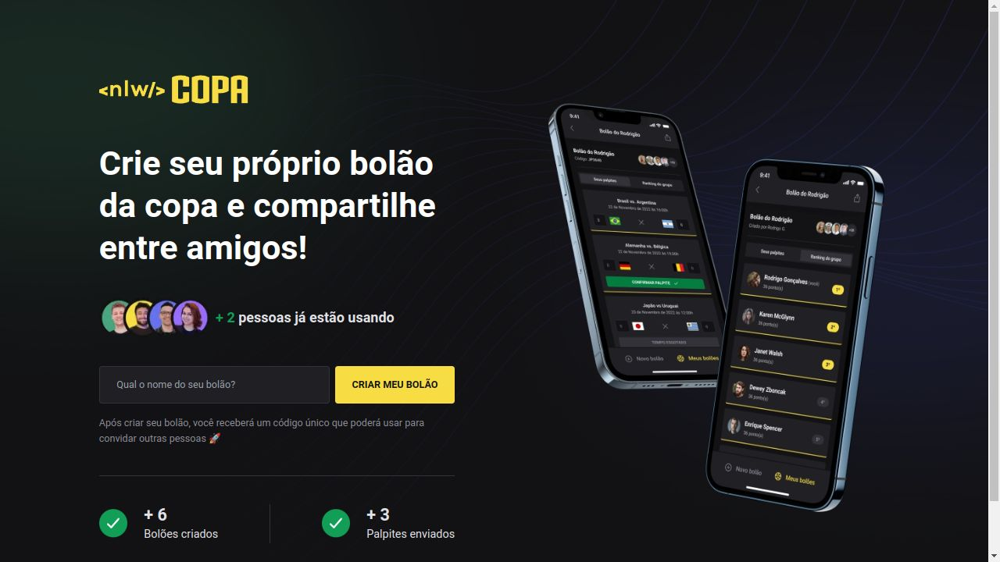

# nlw_copa

 
 

 ### Sobre

 O NLW Copa é uma aplicação com parte web, back-end e mobile, que tem como função a realização de bolões a respeito das partidas de jogos da copa do mundo, no qual esses bolões podem ser realizados entre conhecidos, amigos e até familiares.

## WEB Construido com 

- Next com TypeScript (https://reactnative.dev/docs/typescript)
- AXIOS (https://www.npmjs.com/package/axios)
- TailwindCSS (https://tailwindcss.com/docs/installation)

## BACK-END Construido com 

- Node com TypeScript (https://nodejs.dev/en/learn/nodejs-with-typescript/)
- Fastify (https://www.npmjs.com/package/fastify)
- Prisma (https://www.npmjs.com/package/prisma)
- SQLite (https://www.npmjs.com/package/sqlite)

## MOBILE Construido com 

- REACT NATIVE com TypeScript (https://reactnative.dev/docs/typescript)
- EXPO (https://www.npmjs.com/package/expo)
- AXIOS (https://www.npmjs.com/package/axios)
- Native-base (https://www.npmjs.com/package/native-base)
- phosphor-react-native (phosphor-react-native)

## Começando

Para colocar uma copiaa em execução, siga as estapas

### Pré requisitos

**Git** 
**Git** 
**NPM** 

### Setup
clone o repositorio `git clone https://github.com/peterson1dhon/nlw_copa` no seu terminal.

### Instalar

Execute `npm install` em linha de comando, E rode com NPM RUN DEV, no server(back-end) e no web(front-end).

Execute `npm install` em linha de comando, E rode com NPX EXPO START no mobile (para dispositivos móveis).

### Author 

**PETERSON CAETANO**

### 💛 Contato

peterson.br94@gmail.com
